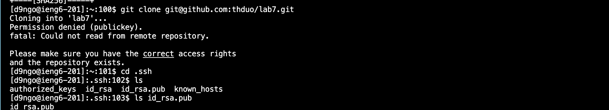
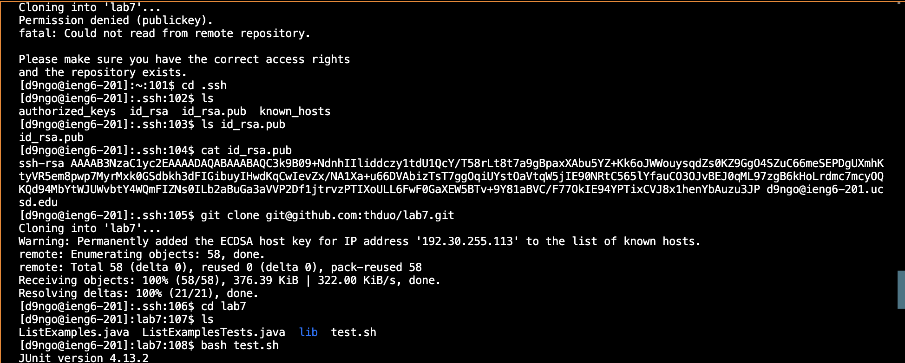
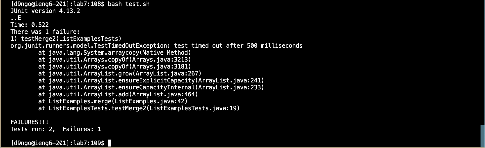
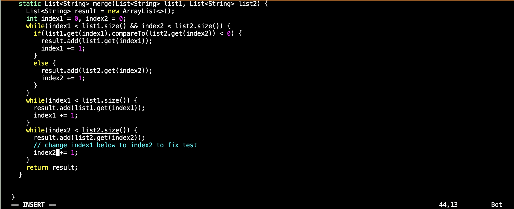
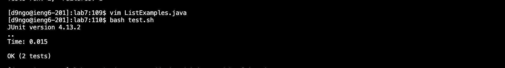
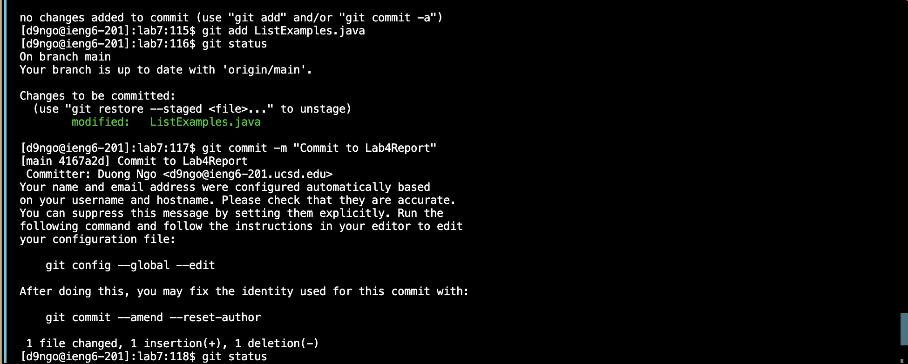
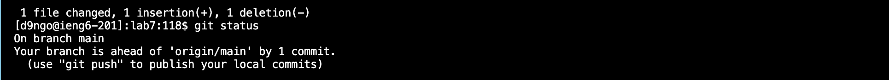
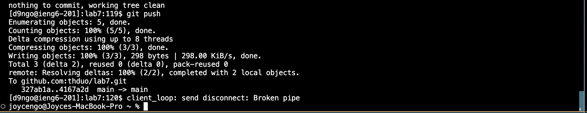
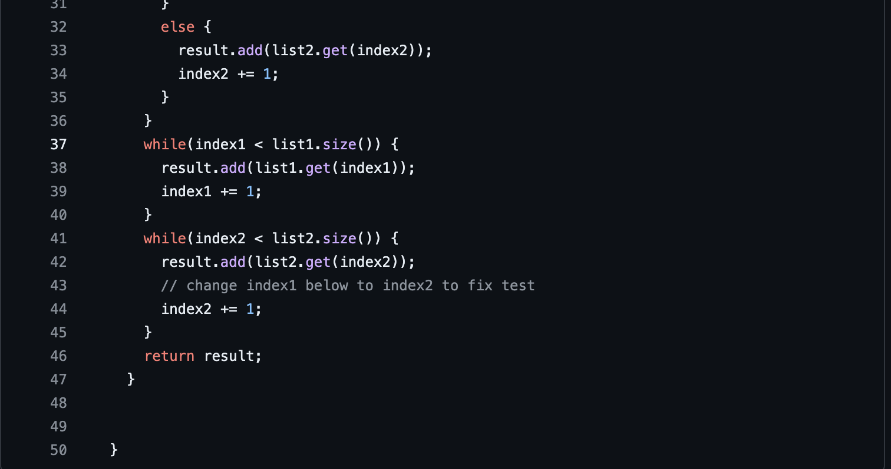

# LAB REPORT 4
# Name: Duong Ngo
# Professor: Joe Gibss Politz

# <u> Step 1 & 2: Log into ieng6 machine and git clone SSH link
Initially, when I use `ssh-keygen` to access my ieng6 account and git clone from my SSH private link which is `git@github.com:thduo/lab7.git`, it could not read from remote repository due to my SSH link from private ieng6 account. Therefore, coming to the second step which is making the lab7 git accessible.

For this step, I will use SSH to git clone lab7 directory. In this image, I use command `cat id_rsa.pub` to know what's inside my public key and pasted that content to SSH Key in Github. After that, I use `git clone git@github.com:thduo/lab7.git` to git clone my forked lab7 directory into the terminal. To make sure I git clone in a correct way, I use command `ls` after `cd lab7` to know the files inside that directory. 

# <u> Step 2: Running the test and demonstrate that they fail 

For this step, I run the command `bash test.sh` to compile and run all the tests in lab7. In the image below, it said there was 1 failure which is `testMerge2(ListExamplesTests)`. 

# <u> Step 3: Edit the code and fix the error

For this step, I run command `vim ListExamples.java` to access the `ListExamples.java` file so that I can edit and fix the error. I use `j` key to move down the desired area which is `// Changing index1 to index 2`. Next, I type `x` to delete `1` and type `i` to insert new character which is `2` demonstrated in the image.
Summary of keys pressed: <j> <j> <j> <j> <j> <x> <i> <2> <ESC> <:wq> <ENTER>

# <u> Step 4: Rerun the test and demonstrate that they succeed

For this step, after changing `index1` to `index2`, I rerun the test by command `bash test.sh`, showing that they now run successfully with the message "OK (2 tests)". 

# <u> Step 5: Git push and commit changes
For this step, I first add the `ListExamples.java` to the `lab7` directory by the command `git add ListExamples.java`. I want to make sure the changed file is add, I use the command `git status` to check if the file is already added or not. The message appear in the image below is that it is already modified with the `ListExamples.java`. Next, I will use the command `git commit -m "Commit to Lab4Report"` with the message "Commit to Lab4Report".  

Next, I will double check the status of the git committed directory by `git status` showed in the image below. 

Lastly, I will use command `git push` to push it in Github. 

# <u> Step 6: Double check if the change in the file is modified. 
In this last step, I will go to my `lab7` directory in Github and go to `ListExamples.java`, after checking, the `index1` now becomes `index2` which determines those successful steps above 

